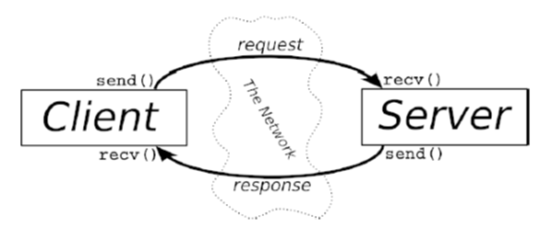

# 06-Client-Server 基础

宝贝，这是个 client-server（客户-服务器）的世界。单纯与网路处理 client processes（客户进程）及 server processes（服务器进程）通讯的每件事情有关，反之亦然。以 telnet 为例，当你用 telnet（client）连接到远端主机的 port 23 时，主机上的程序（称为 telnetd server）就开始动了起来，它会处理进来的 telnet 连接，并帮你设定一个登录提示符等。

Client 与 server 间的信息交换摘录於上列的图解中。

需要注意的是 client-server pair 可以使用 SOCK\_STREAM丶SOCK\_DGRAM 或其它的（只要它们用一样的协议来沟通）。有一些不错的 client-server pairs 示例，如：telnet/telnetd丶ftp/ftpd 或 Firefox/Apache。每次你使用 ftp 时，都会有一个 ftpd 远端程序来为你服务。

一台设备上通常只会有一个 server，而该 server 会利用 fork()来处理多个 clients。基本的例程（routine）是：server 会等待连接丶accept() 连接，并且 fork() 一个 child process（子进程）来处理此连接。这就是我们在下一节的 server 示例所做的事情。
